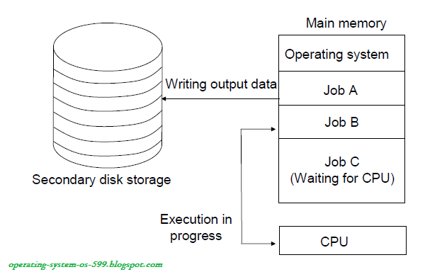

# 운영체제

## 운영체제 개념과 발전 목적

* 운영체제의 개념
  * 컴퓨터를 편리하게 사용할 수 있도록 도와준다.
  * 하드웨어를 효율적으로 사용할 수 있또록 다양한 기능을 제공하는 소프트웨어이다.

* 운영체제의 발전 목적
  * 편리성
    1. 사용법을 쉽게 배운다.
    2. 원하는 기능을 찾기 쉽다.
    3. 실수로 부터 회복이 가능하다.
    4. 직관으로부터 원하는 기능을 수행가능하다.
    5. 사용방식 변경이 용이하다.
  * 효율성(시스템 성능 향상)
    1. **처리량 향상**: 단위 시간당 처리하는 작업량
    2. **지연, 응답시간 단축**: 사용자가 시스템에 작업을 의뢰한 후 반응을 얻을 때까지 걸린 시간
    3. **신뢰도 향상**: 실패없이 주어진 기능을 수행할 수 있는 능력
    4. **사용 가능도 향상**: 사용자가 일정 기간 동안 컴퓨터를 실제로 사용한 시간(비율)
  * 제어 서비스 향상
    1. 입출력장치의 동작 관리 및 제어
    2. 시스템 오류 예방

## 운영체제의 기능

* #### 자원 관리

  1. 메모리 관리: 메모리 관리 기능은 메인 메모리와 보조 기억장치로 구분한다.

     * 메인 메모리 관리: 대개 프로세서가 직접 주소로 지정할 수 있는 유일한 메모리.
     * 보조기억장치 관리: 프로세서가 직접 주소 지정 불가하다.

  2. 프로세스 관리: 프로세스란 실행중인 프로그램을 의미하며 시스템 코드를 수행하는 운영체제(시스템) 프로세스와 사용자 코드를 수행하는 사용자 프로세스로 구분한다.

  3. 주변장치(입출력장치) 관리: 운영체제는 특수 프로그램인 장치 드라이버(Software)를 사용하여 입출력장치와 상호작용한다.

  4. 파일(데이터) 관리: 파일 관리는 입출력 파일의 위치, 저장과 검색 관리를 의미한다.

     

* #### 시스템관리

  운영체제는 추가로 시스템 보호, 네트워킹, 명령 해석기 등 기능을 지원한다.

  1. 시스템보호(사용자 권한 부여)
  2. 네트워킹(통신)
  3. 명령 해석기: 명령 해석기는 커널의 일부일때 비정상 프로세스가 커널의 특정 부분에 접근할 수 있으므로 커널에서 분리하는 것이 좋음.

### 운영체제의 발전과 유형

* #### 운영체제의 발전과정

  | 연도          | 운영체제                                                     | 특징                                                         |
  | ------------- | ------------------------------------------------------------ | ------------------------------------------------------------ |
  | 1940년대      | 없음(작업 순차 처리)                                         | * 기계어를  직접 사용 * 단순 순차(직렬) 처리            |
  | 1950년대      | 일괄 처리 시스템                                             | * 운영체제의 효시인 IBM 701 개발 * 작업별로 일괄처리 * 버퍼링, 스풀링 방법 등장 |
  | 1960년대      | 1. 다중 프로그래밍 시스템 2. 시분할 시스템 3. 다중 처리 시스템 4. 실시간 처리 시스템 | * 가상 기억장치 등장 * 다중 프로그래밍, 다중 처리, 시분할 처리 등 개념 등장 * 운영체제를 고급 언어로 작성 * 데이터 통신 지원용 운영체제 사용 |
  | 1970년대 초반 | * 다중 모드 시스템 * 범용 시스템                        | * 일괄 처리, 시분할 처리, 실시간 처리, 다중 프로그래밍 등을 제공하는 다중 모드 시스템 등장 * 장치의 독립성 제공 * TCP/IP 통신 표준 활성화 * 운영체제가 네트워크와 보안을 아우르는 수준으로 발전 |
  | 1970년대 중반 | 분산 처리 시스템                                             | * 각종 응용프로그램 개발 및 데이터베이스 활용 확대 * 네트워크 기술의 발전 * 하드웨어에 운영체제 개념이 포함된 펌웨어 개념 등장 |
  | 1990년대      | 병렬 계산과 분산 계산                                        | * 월드와이드웹의 등장으로 분산 컴퓨팅 증가 * GUI 강화 * 개인용과 서버용 운영체제의 보편화 |
  | 2000년대 이후 | * 모바일 및 임베디드 * 가상화 및 클라우드 컴퓨팅        | * 네트워크 기반의 분산 및 병렬 운영체제의 보편화 * 모바일 장치와 가전제품을 위한 모바일 및 임베디드 운영체제의 보편화 * 다양한 통신망의 확대와 개발형 시스템 발달 * 여러 운영체제가 한 시스템의 자원을 공유할 수 있게 해주는 서버 가상화 기술의 확산 * 컴퓨팅 자원, 스토리지, 소프트웨어 등을 사용자에게 서비스 형태로 제공하는 클라우드 컴퓨팅의 등장 |

  

1. ##### 1940년대: 운영체제 없음

   작업이 들어오는대로 처리하는 방식. 컴퓨터에 필요한 모든 작업을 프로그램에 담았으며 중간에 문제가 발생하면 다른 사용자에게 넘겨주고 다시 자신의 차례를 기다려야했다.

   

2. ##### 1950년대: 일괄 처리 시스템

   

   초기 운영체제인 일괄 처리 시스템(Batch Processing System)은 작업을 올리는 시간과 해제하는 시간 낭비를 줄이는 데 관심을 더 두었다. 작업 시간을 줄이기 위해서 작업이 발생할 때마다 즉시 처리하지 않고 작업이 일정 기간 또는 일정량이 될 때까지 모아두었다가 한꺼번에 처리했다. 이를 위해서 **버퍼링,** **스풀링**의 방법이 도입되었다.
   

   단점은 준비 작업들의 유형이 동일해야 하고, 작업에 모든 유형을 입력할 수 없다는 것이다.

   * 버퍼링(Buffering): 프로세서와 입출력장치의 속도 차이로 생긴 유휴시간이 없도록 입출력장치별로 입출력 버퍼를 두어, 프로세서에서 연산을 할 때 동시에 다른 작업을 입출력하는 방법
   
   * 스풀링(Spooling, Simultaneous peripheral operation on-line): 속도가 빠른 디스크를 버퍼처럼 사용하여 입출력장치에서 미리 읽는 것이다. 버퍼링이 컴퓨터 하드웨어의 일부인 버퍼를 사용한다면, 스풀링은 별개의 오프라인 장치를 사용한다는 점이 다르다.
   
     
   
3. ##### 1960년대: 다중 프로그래밍. 시분할, 다중 처리, 실시간 시스템

   특징: 장치의 독립성을 이용한 편리한 하드웨어 관리와 다중 프로그래밍, 시분할, 다중 처리, 실시간을 이용한 시스템의 처리능력 향상

   * 다중 프로그래밍: 여러 프로그램을 메모리에 나눠 적재한 후 프로세서를 번갈아 할당하여 프로세서의 사용을 극대화하면서 여러 프로그램을 동시에 실행한다.

   * 시분할 시스템: 다중 프로그래밍 시스템에 프로세서 스케줄링이라는 개념을 더한것이다. 일정한 프로세서 사용 시간을 할당하여 빠른 응답이 가능하므로 사용자와 대화하는 방법으로 여러 프로그램을 실행한다. 
   * 다중처리 시스템은:하나의 시스템에서 여러개의 프로세서를 사용하여 처리능력을 높인것이다. 
   * 실시간 처리 시스템은 미리 설정된 시간 내에 응답한다는 특징이 있다.

   

4. ##### 1970년대 초반: 다중 모드, 범용 시스템

   일괄 처리, 시분할 처리, 실시간 처리, 다중처리를 모두 제공하는 다중 모드 시스템도 등장
   

5. ##### 1970년대 중반 ~1990년대: 분산 처리 시스템, 병렬 계산과 분산 계산

   1970년대의 명령어 중심의 시스템 사용법이 1980년대에는 사용자에게 편리한 메뉴 지향적인 시스템으로 대체되었고, 1990년대에는 GUI(Graphical User Interface)시스템으로 발전했다.

   

6. ##### 2000년대 이후 : 모바일 및 임베디드, 가상화 및 클라우드 컴퓨팅

   모바일 운영체제: Android, IOS 등

   * 가상화

     ​	
     

     * 가상화(Virtualiztion) 기술이 본격적으로 확산되었다. 여러가지의 가상화가 있는데 가상화 핵심은 서버가상화 이다. 방법에 따라 호스트 운영체제에서 가상 머신을 구동하는 **호스트기반 가상화**와 호스트 운영체제 설치 전에 가상화 솔루션을 탑재하여 가상의 CPU, 메모리, 디스크, 네트워크 카드등을 생성하는 **베어메달(bare-metal)기반 가상화**로 분류할 수 있다.

     

   * 클라우드 컴퓨팅: 서버 가상화 기술을 이용하여 사용자에게 컴퓨팅 자원, 스토리지, 소프트웨어 등을 서비스 형태로 제공하는 클라우드 컴퓨팅이 등장했다. 그리드 컴퓨팅, 유틸리티 컴퓨팅, 서버 기반의 컴퓨팅의 특징을 조금씩 차용한 개념

     

     * 클라우드 컴퓨팅 기술을 이용한 서버스는 크게 IaaS, PaaS, SaaS로 분류됨
       * IaaS(Infrastructure as a Service): 데이터 센터에 있는 서버, 스토리지, 네트워크 등 인프라나 자원을 가상화하여 인터넷으로 제공 (ex : 아마존 EC2)
       * PaaS(Platform as a Service): 응용 프로그램의 구축, 테스트 및 설치가 가능한 통합 개발 환경을 웹으로 제공한다.
       * SaaS(Software as a Service): 특정 소프트웨어를 인터넷으로 제공한다. 그 소프트웨어는 On Demonad 소프트웨어 라고 함.

* #### 운영체제의 유형

  1. **다중 프로그래밍 시스템**: 다중 프로그래밍은 프로세서가 유휴 상태일 때 실행 중인 둘 이상의 작업이 프로세서를 전환(인터리빙)하여 사용할 수 있도록 동작한다. 다시말해 여러 프로그램을 메모리에 적재한 후 하나의 프로그램이 프로세서를 사용하다가 입출력 동작등을 하면서 사용하지 않는 동안 다른 프로그램이 프로세서를 사용하도록 하는 시스템.

     

     * 장점: 높고 효율적인 프로세서 사용률(효율적인 운영)이 증가하여 마치 많은 사용자의 프로그램이 거의 동시에 프로세스를 할당받는 듯한 느낌을 준다.

       
       

  2. **시분할 시스템**: 다중 프로그래밍을 논리적으로 확장한 개념으로 ,프로세서가 다중 작업을 교대로 수행한다. 프로세서에 적재된 여러 프로그램을 교대로 실행하지만, 각 프로그램에 일정한 프로세서 사용시간(time slice) 또는 규정 시간량(Quantum)을 할당하여 사용자가 주어진 시간 동안 컴퓨터와 대화하는 형식으로 실행한다. **다중 프로그래밍 시스템이 프로세서 사용을 최대화하는 것이 목표라면, 시분할 시스템은 응답시간을 최소화하는 것이 목표라는 큰 차이**가 있다.

     

     

     * 장점
       * 빠른 응답 제공
       * 소프트웨어의 중복 회피 가능
       * 프로세서 유휴시간 감소
     * 단점
       * 신뢰성 문제
       * 보안 의문 및 사용자 프로그램과 데이터의 무결성
       * 데이터 통신의 문제

     

  3. **다중 처리 시스템**: 다중처리(Multiprocessing 시스템은 단일 컴퓨터 시스템 내에서 둘 이상의 프로세서를 사용하여 동시에 둘 이상의 프로세스(프로그램을 지원한다) -> 운영체제는 하나다.

     

     다중 처리 시스템은 프로세서가 여러 개이므로 프로세서 간의 연결 상호작용, 역할 분담 등을 고려해야한다.

     

  4. **실시간 처리 시스템**

     실시간 처리 시스템은 더 높은 적시 응답을 요구하는 장소에서 사용하거나 데이터 흐름 또는 프로세서 연산에 어멱한 시간 요구가 있을 때 사용할 수 있다.

     * 실시간 처리 시스템 2가지 유형
       * **경성 실시간 처리 시스템(Hard real time processing system)**: 작업의 실행 시작이나 완료에 대한 시간 제약 조건을 지키지 못할 때 시스템에 치명적인 영향을 주는 시스템(ex: 무기 제어)
       * **연성 실시간 처리 시스템(Soft real time processing system)**: 작업 실행에서 시간 제약 조건은 있으나, 이를 지키지 못해도 전체 시스템에 치명적인 영향을 미치지 않는 시스템(ex: 동영상 재생)

     

  5. **분산 처리 시스템**

     분산 처리 시스템은(distrubuted processing system은 시스템마다 독립적인 운영체제와 메모리로 운영하며, 필요할 때 통신하는 시스템)
     

## 운영체제의 서비스

* 운영체제가 컴퓨터 입장에서 제공하는 기능
  * 부팅 서비스: 컴퓨터 하드웨어를 관리하고 프로그램을 실행할 수 있도록 컴퓨터에 시동을 건다. 
  * 사용자 서비스: 프로그래머가 프로그래밍 작업을 쉽게 수행할 수 있도록 한다.
  * 시스템 서비스: 시스템의 효율적인 동작을 보장한다.
  * 시스템 호출: 프로그램이 운영체제의 기능을 서비스받을 수 있는 프로그램과 운영체제간의 인터페이스를 제공한다.

* **부팅 서비스**: 운영체제를 메인 메모리에 적재하는 과정을 부팅(Booting)또는 부트스트래핑(Bootstrapping)이라고 한다. Boot loader는 Bootstrap loader을 줄인 말로 하드디스크와 같은 보조기억장치에 저장된 운영체제를 메인메모리에 적재하는 소규모 프로그램이다.
* **사용자 서비스**: 운영체제에서 프로그래머의 프로그래밍 작업을 쉽게 수행하도록 다음 사용자 서비스를 제공한다.
  * 사용자 인터페이스 제공: 컴퓨터와 사용자의 상호작용을 하는 것으로 CLI나 GUI형태로 제공된다.
    * CLI : Command Line Interface
    * GUI: Graphical User Interface
  * 프로그램 실행: 프로그램을 실행하려면 먼저 메모리에 적재해야 하고, 프로세서 시간을 할당해야한다.
  * 오류탐지: 발생한 오류에 따라 적절히 조치한다.
    * 프로세서, 메모리 하드웨어와 관련오류: 기억장치 메모리 오류, 정전
    * 입출력장치 오류 : 테이프의 패리티오류, 카드 판독기의 카드 체증(jam), 프린터의 종이부족
    * 사용자 프로그램 오류: 연산의 오버플로, 부적당한 기억장치 장소 접근, 프로세서 시간을 지나치게 많이 사용
* **시스템 서비스**
  * 자원 할당
  * 계정 관리
  * 보호와 보안
* **시스템 호출(System Call)**: 실행중인 프로그램과 운영체제 간의 인터페이스로 API(Application Programming Interface)라고도 한다. 일반적인 시스템 호출에는 프로세스 제어, 파일 조작, 장치 관리, 정보유지등이 있다.

## 운영체제의 구조

#### 1. 단일 구조 운영체제

운영체제의 모든 기능을 커널과 동일한 메모리 공간에 적재한 후 시스템 호출만으로 사용할 수 있다.(ex: DOS:Disk Operating System, 초기의 UNIX)

* ##### 장단점

  * 장점
    * 단일 구조 운영체제에서는 대부분의 기능을 커널에 그룹화해서 구현하므로, 운영체제와 하드웨어가 직접 통신하여 시스템 자원을 효율적으로 관리할 수 있다
  * 단점
    * 커널의 크기가 상대적으로 커지면서 버그의 원인이나 기타 오류를 구분하기 어렵고, 새 기능을 추가하는 수정과 유지 보수가 매우 어렵다. 또 동일한 메모리에서 실행하므로 한 부분에서 발생한 문제 때문에 시스템 전체에 심각한 영향을 줄 수 있다

#### 2. 계층 구조 운영체제

비슷한 기능요소들을 수행하는 요소들을 그룹화하여 계층적으로 구성한다. 각 계층들은 인접한 상위나 하위에 있는 계층과 상호작용한다.

* 장단점
  * 장점
    * 단일 구조 운영체제보다 모듈화가 잘 되어 있다.
    * 계층 구조에서는 시스템 검증과 오류 수정을 쉽게 할 수 있다.
  * 단점
    * 계층을 정의하기 어렵다.
    * 모든 계층이 시스템에 제한 없이 접근할 수 있어 오류나 악성 코드에 민감하게 반응할 수 있다.

#### 3. 마이크로 커널 구조 운영체제

커널에는 최소 기능만 포함시켜 크기를 대폭 줄이고 기타 기능은 사용자 공간으로 옮겨 사용자 영역에서 수행하는 서버 구현방법으로 구현된 운영체제

* 장단점
  * 장점
    * 커널을 가볍게 했다
    * 운영체제 서비스를 사용자 영역의 독립적인 서버에서 수행하기 떄문에 서버에서 잘못 수행하더라도 다른 서버와 커널에 치명적인 영향을 주지 않는다.
    * 서버 개발이 용이하고, 운영체제의 기능을 쉽게 변경할 수 있다.
    * 모듈화 정도가 높아 확장성, 이식성이 높다.
  * 단점
    * 모듈 간에 통신이 빈번하게 발생하여 성능이 떨어질 수 있다.
    * 커널을 출입하는 문맥 교환 때문에 속도가 느리다.

# Reference

Image1: [Link](https://www.google.com/url?sa=i&source=images&cd=&cad=rja&uact=8&ved=2ahUKEwi82N2KzvLmAhUlxosBHcLrCcwQjRx6BAgBEAQ&url=https%3A%2F%2Fwww.youtube.com%2Fwatch%3Fv%3DKpCDZgKmYn4&psig=AOvVaw1RPusSm65WtjzPHZoJqy_S&ust=1578524989091976)

Image2: [Link](https://operating-system-os-599.blogspot.com/2017/02/multi-programming.html)

Image4: [Link](https://slideplayer.com/slide/777506/)

Image5: [Link](http://www.technologyuk.net/computing/computer-software/operating-systems/operating-system-architecture.shtml)

