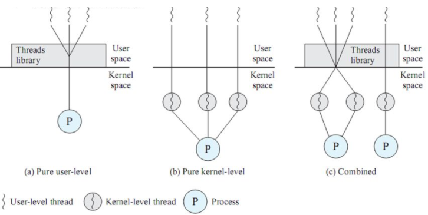

# 프로세스와 스레드

### 프로세스의 개념과 상태 변화

1. #### 프로세스의 개념

   * 실행 중인 프로그램
   * 실행 중인 프로시져
   * 프로세서에 할당하여 실핼할 수 있는 개체(dispatch가 가능한 대상)

   프로세스가 실행 중인 프로그램이 되려면 프로세서, 메모리, 파일, 입출력장치같은 자원이 필요하다. 그래서 프로세스를 생성하거나 실행할 때 이 자원들을 할당한다. 또 프로세스는 현재 활동 상태를 나타내는 프로그램 카운터, 프로세서의 현재 활동(Register 내용)도 포함한다.

   

   

   프로그램은 컴파일한 코드와 초기화 전역변수, 문자열과 문자열 상수 등 정적 데이터를 포함하는 정적인 개체이지만 프로세스는 위와 같은 구조를 가지는 메모리 구조를 이루고, 프로그램 카운터나 레지스터처럼 현재 어떤 자원을 사용하는지 관련 정보가 들어 있는 동적인 개체이다.

* 스택 : 데이터를 일시적으로 저장하는 영역
* 힙: 동적으로 메모리를 할당하는 영역
* 데이터: 데이터는 프로그램의 가상 주소 공간, 전역변수나 정적변수를 저장하거나 할당하고 실행하기 전에 초기화한다.
* text(code): 실행 명령을 포함하는 메모리이거나 목적 파일에 있는 프로그램 영역, 코드영역을 공유할 수 있음.

​	**프로세스는 수행하는 역할에 따라 시스템(커널) 프로세스와 사용자 프로세스로 구분된다.**

#### 2. 프로세스의 상태변화도

* 프로세스 제어블록 구성
  * **프로세스 식별자**: 프로세스의 고유 식별자

  * **프로세스 상태**: 생성, 준비, 대기, 중단 등 상태 표시

  * **프로그램 카운터**: 프로세스를 실행하는 다음 명령의 주소 표시

  * **CPU레지스터 내용**: CPU에서 작업하던 내용(인터럽트 됐을 때 기존 내용 저장)

  * **프로세스 스케줄링 정보**: 프로세서의 우선순위 등

  * **계정정보, 입출력상태, 메모리 관리 정보 등등**

    

* Context Switching(프로세스 문맥 교환)

  * 일정 시간이 경과하거나 인터럽트에 의해 실행 중인 프로세스를 다른 프로세스로 교환하여 실행할 떄 발생하는 CPU레지스터 내용 교환.

    

### 2. 프로세스의 관리

​	프로세스는 실행 중에 프로세스 생성 시스템을 호출을 이용하여 새로운 프로세스를 생성할 수 있다. 생성이 되면 계층적으로 생성하는데, 새로 생성하는 프로세스는 부모 프로세스(parent process)이고, 생성되는 프로세스는 자식 프로세스(child process)또는 서브 프로세스(sub process)라고 한다.

1. ##### 프로세스의 생성

   1. 새로운 프로세스에 프로세스 식별자를 할당한다.
   2. 프로세스 구성요소를 담는 주소 공간과 프로세스 제어블록(PCB) 공간을 할당한다.
   3. 프로세스 제어 블록을 초기화한다.
   4. 링크를 건다(해당 큐에 삽입한다.)

2. ##### 프로세스의 종료 / 프로세스의 제거

   * 프로세스가 마지막 명령을 실행하면 운영체제에 프로세스의 삭제를 요청한다. 또 부모 프로세스는 자식 프로세스가 할당된 자원을 초과하여 사용할떄나 할당한 작업이 더는 없을 때 자식 프로세스도 종료시키는데 이를 **연속종료**라고 한다.

3. ##### 프로세스 중단과 시작

   * 시스템에 장애가 발생
   * 프로세스에 의심스러운 부분이 있을 때
   * 처리할 작업이 너무 많아 시스템에 부담이 될때

4. ##### 프로세스의 우선순위 변경

   * 준비 리스트의 프로세스는 프로세서 중심 프로세스와 입출력 중심 프로세스로 구분할 수 있다. 입출력 중심 프로세스는 프로세서를 짧게 자주 사용하도록 하고, 프로세서 중심 프로세스는 프로세서를 길게 사용하되 사용 횟수를 줄여서 균형을 유지할 수 있다.

5. ##### 프로세스의 문맥 교환

   
   

   * 입출력 인터럽트
   * 클럭 인터럽트
   * 시스템 인터럽트(기존의 프로세스를 그냥 저장했다가 시스템 인터럽트를 처리하고 그 프로세스를 다시 적재하기 때문에 문맥교환은 일어나지 않음.)

### 스레드의 개념과 상태 변화

1. 스레드의 개념
   * 프로세스는 자원과 제어로 구성되어있는데 이 중 제어만 분리한 실행 단위를 Thread라고 한다. 스레드들은 프로세스의 직접 실행 정보를 제외한 나머지 프로세스 관리 정보를 공유한다.
2. 스레드를 사용하였을때 이점
   * 사용자 응답성 증가
   * 프로세스의 자원과 메모리 공유 가능
   * 경제성이 좋음
   * 다중 처리(멀티 프로세싱)로 성능과 효율 향상

### 스레드의 구현

사용자 수준 스레드는 스레드 라이브러리를 이용하여 작동하는 형태이고, 커널 수준 스레드는 커널(운영체제)에서 지원하는 형태이다. 이 둘을 혼합한 형태가 혼합형 스레드이다

* 사용자 수준 스레드(User Level Thread): n:1 매핑
* 커널 수준 스레드(Kernel Level Thread): 1:1 매핑
* 혼합형 수준 스레드(multiplexed Thread): n:1 매핑

1. #### 사용자 수준 스레드

   스레드와 관련된 모든 행위를 사용자 영역에서 하므로 커널이 스레드의 존재를 모른다.  다수의 사용자 영역 스레드가 커널 스레드 한개에 매핑되므로 다대일 스레드 매핑이라고 한다.

   
   

2. #### 커널 수준 스레드

   커널이 스레드와 관련된 모든 작업을 관리한다. (PCB와 TCB유지)

   사용자 영역 스레드와 커널 영역 스레드가 1:1로 매핑된다.

   
   

3. #### 혼합형 스레드

   다수의 사용자 수준 스레드에 다수의 커널 스레드가 n:m으로 매핑된다.

