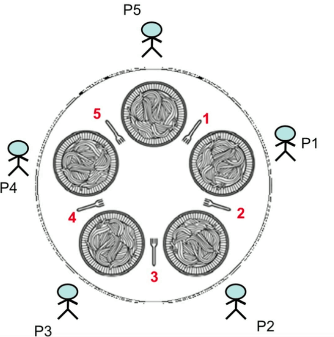

# 교착 상태와 기아 상태

### 교착 상태의 개념

교착상태(Deadlock): 다중 프로그래밍 시스템에서는 프로세스가 결코 일어나지 않을 사건을 기다리는 상태가 되면 교착 상태에 빠졌다고 말한다.

* 교착 상태는 하나 이상의 작업에 영향을 주기 때문에 무한 대기나 기아 상태보다 더 심각한 문제를 일으킨다.
* 교착 상태는 시스템 자원에 요구가 뒤엉킨 상태로, 두 프로세스가 사용하는 **비공유 자원**을 서로 기다리고 있을 때 발생한다 -> 즉 둘 이상의 작업이 중단되고 프로세스들은 서로 사용할 자원을 기다리고만 있게 된다.

* 만약 위 그림에서 Resource1을 가진 Process1이 해제를 안하고 Resource2를 요청하게 되면 영원히 기다리게 되는데 위 상황이 교착상태이다. 따라서 둘 이상의 프로세스가 다른 프로세스가 점유하고 있는 자원을 서로 기다릴 때 교착 상태가 발생한다.

  

  * 프로세스의 자원 사용 순서

    1. 자원 요청

    2. 자원 사용

    3. 자원 해제

       
       

#### 교착 상태의 발생 조건

1. 상호배제: 자원이 최소 하나 이상의 프로세스에 의해 비공유 되어야한다. 한번에 프로세스 하나만 해당자원을 사용할 수 있어야 한다.
2. 점유와 대기: 자원을 최소 하나는 보유하고, 다른 프로세스에 할당된 자원을 얻으려고 기다리는 프로세스가 있어야 한다.
3. 비선점: 자원은 선점할 수 없다. 즉, 자원은 강제로 빼앗을 수 없고, 자원을 점유하고 있는 프로세스가 끝나야 해제된다.
4. 순환대기: 자원 Rn은 Pn이 점유하고 있고 Pn은 Rn+1을 요구하고 있는 상황을 순환대기라고 한다.

### 교착 상태의 해결 방법

* 교착 상태를 해결하는 방법은 크게 다음 세 가지로 나눌 수 있다.
  1. 교착 상태가 발생하지 않도록 **예방(Prevention)**하는 방법 - 비용이 높음
  2. 교착 상태의 발생 가능성을 배제하지 않고 이를 적절히 **회피(Avoidance)**하는 방법
  3. 교착 상태를 허용하되 교착 상태를 **탐지(Detection)**하여 다시 회복하는 방법 - 비용낮음

* #### 교착상태 예방

  * **자원의 상호배제 조건방지(비현실적 - 다중프로그래밍에서 불가)**

    * 일반적으로 상호배제 조건을 허용하지 않으면 교착 상태를 예방할 수 없다.

  * **점유와 대기 조건 방지(일부 자원만 할당 방지):** 프로세스가 실행에 필요한 자원을 한꺼번에 요구하고 허용할 때까지 작업을 보류하여 대기 조건이 성립하지 않도록 하여 교착상태를 예방한다.

    * 시스템 호출된 프로세스 하나를 실행하는 데 필요한 모든 자원을 먼저 할당하여 실행한 후 다른 시스템 호출에 자원을 할당하는 방법.

    * 또는 프로세스가 자원을 전혀 갖고 있지 않을 때만 자원을 요청할 수 있도록 허용하는 방법.

      

    * 단점

      *  자원의 효율성이 너무 낮다. 

      * 기아 상태가 발생할 수 있다.

        

  * **비선점 조건 방지(할당된 자원의 반납 가능): 이미 할당된 자원도 반납 가능해야한다.**

    * 프로세서 레지스터나 기억장치 레지스터와 같이 쉽게 저장되고 이후에 다시 복원하기 쉬운 자원에 사용가능하다.

    * 프린터, 카드 판독기, 테이프 드라이버 같은 자원에는 사용되기 어렵다.

      

  * 순환(환형) 대기 조건 방지(수환 대기 상황 회피)

    * 모든 자원에 일련의 순서를 부여하고 각 프로세스가 오름차순으로만 자원을 요청할 수 있게 한다. 
    * 단점: 순환 대기 조건 방지는 프로세스의 속도를 떨어뜨리고 자원 접근을 불필요하게 거부하기 때문에 비효율 적이다. 

* #### 교착상태 예방

  * 교착 상태 예방에서 엄격한 조건때문에 효율성과 처리량을 떨어뜨렸기에 덜 엄격한 조건을 요구하여 자원을 좀 더 효율적으로 사용하는 것이 목적이다.
  * **프로세스의 시작 중단**
    * 시스템의 상태는 안정, 불안정 상태로 나눌 수 있고, 그중에서 교착상태는 불안정 상태에서만 발생한다. 그러나 모든 불안정 상태가 교착 상태인 것은 아니다. 교착상태가 되기 쉬울 뿐이지.(자원을 어디에 주느냐에 따라 교착상태에 빠질 수도 아닐 수도 있다.)
  * **자원 할당 거부(은행가 알고리즘)**
    * 할당 허용 여부를 결정하기 전에 미리 결정된 모든 자원의 최대 가능한 할당량을 시뮬레이션 하여 안정 여부를 검사한다.
    * 다음 단점들에 대해서는 실용적이지 못함
      * 일정하게 남아 있는 자원 수를 파악하기가 매우 어렵다.
      * 다중 프로그래밍 시스템에서는 사용자 수가 항상 변한다.
      * 시스템 과부하가 증가함
      * 프로세스는 자원을 보유한 상태로 끝낼 수 없다.
      * 사용자의 최대 필요량을 파악하기가 어렵다.
      * 항상 불안정 상태를 방지해야하므로 자원 이용도가 낮다.
        

* **교착상태 회복**

  * 교착상태 탐지 알고리즘(오버헤드가 더 큼)
  * 교착 상태 회복 방법
  * 자원 선점

### 기아상태

프로세스의 우선 순위가 낮아서 원하는 자원을 결코 할당 받지 못하는 상태

대표적인 문제가 위의 식사하는 철학자 문제.

테이블에는 음식 5개와 포크 5개가 있다. 음식을 먹을 때는 포크를 반드시 2개 사용해야하고 동시에 사용할 수는 없다. 어떤 철학자가 생각 중일 때 다른 철학자는 간섭하지 않는다. 생각을 하다 배가 고픈 철학자는 주위에 있는 왼쪽과 오른쪽 포크 2개를 들려고 한다. 철학자는 한 번에 포크를 한 개만 들 수 있으며, 왼쪽 포크를 먼저 집은 후 오른쪽 포크를 집는다(공유 자원). 이웃 철학자가 이미 들고 있는 포크를 집을 수 없다(경쟁상태). 배가 고픈 철학자는 포크 2개를 집으면 식사를 하고 식사를 마치면 포크 2개를 내려놓고 계속 생각을 한다.

* 철학자들이 모두 왼쪽포크를 집고 오른쪽 포크를 요구하면 모두 굶어 죽는다. 
* 해결책은 포크를 세마포로 표시하는 방법이다.  하지만 여전히 한쪽만 한쪽만 전부 집게되면 교착상태가 발생한다. 
* 그에 따른 몇가지 해결책들
  * 철학자 4명만 테이블에 동시에 앉도록 한다.
  * 철학자가 양쪽 포크를 모두 사용할 수 있을 때 포크를 잡을 수 있도록 허용한다(임계영역 안에서)
  * 비대칭 해결법: 홀수 번째 철학자는 왼쪽 포크를 잡은 후 오른쪽 포크를 집게 하고, 짝수 번째 철학자는 오른쪽 포크를 잡은 후 왼쪽 포크를 집게 한다.

# Reference

Image1: [Link](https://www.geeksforgeeks.org/introduction-of-deadlock-in-operating-system/)

Image1: [Link](https://medium.com/@ashenmalaka56/the-dining-philosophers-problem-using-java-e710c8fb5b50)