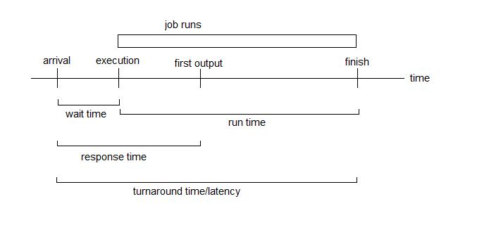
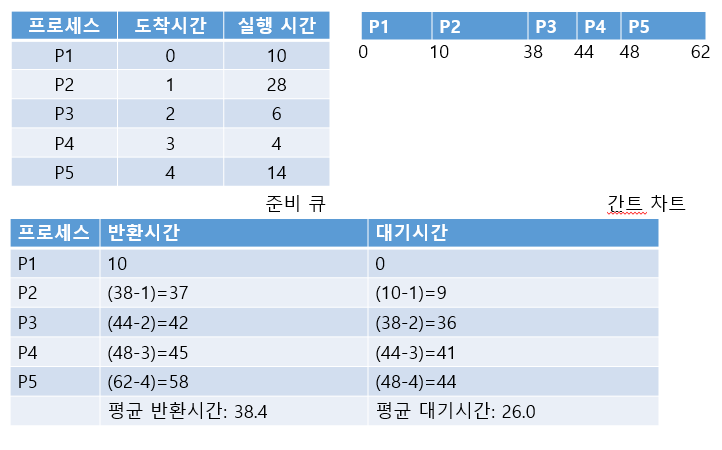
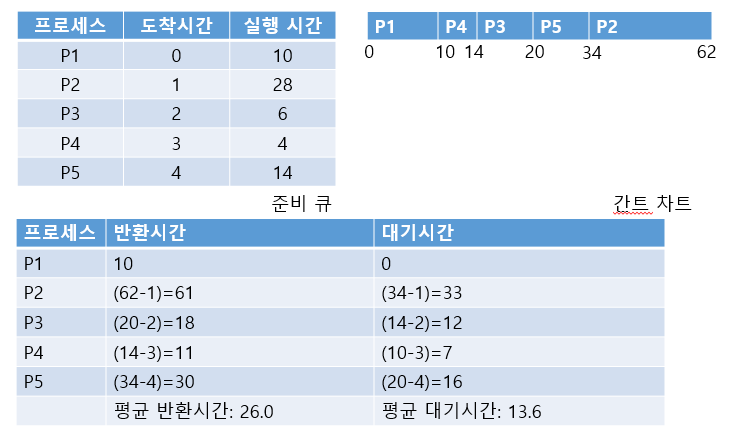
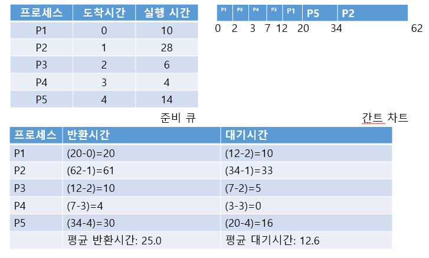
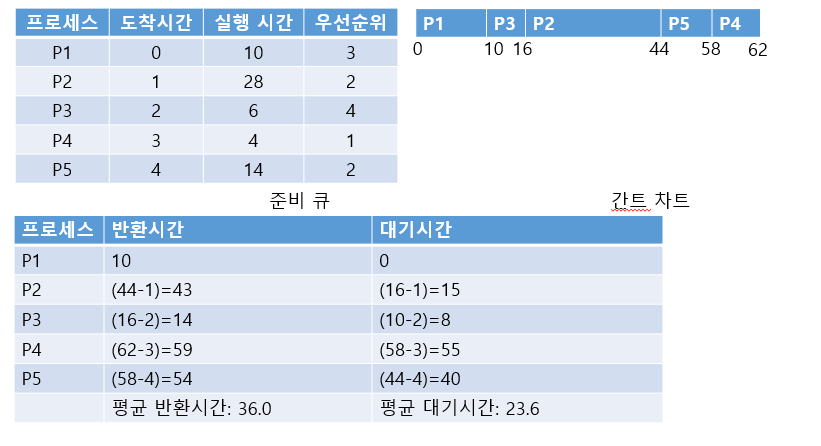
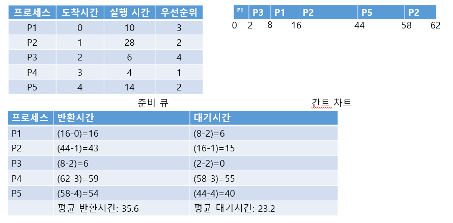
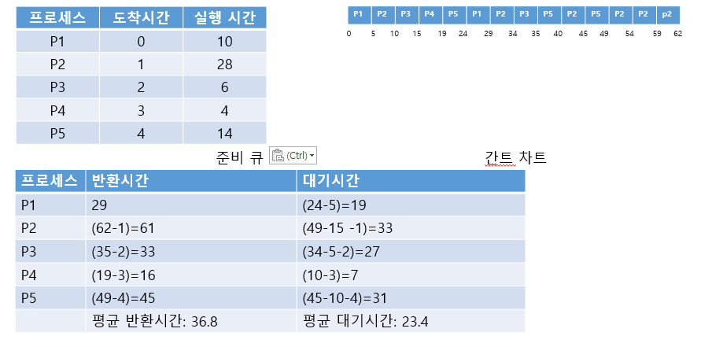
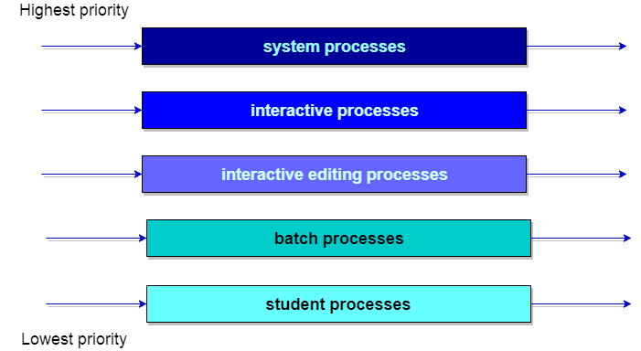
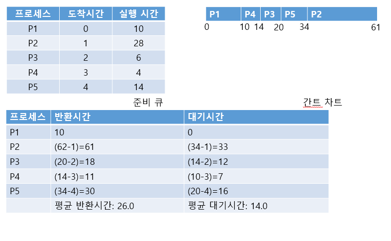

# 프로세스 스케줄링

### 스케줄링의 이해

#### 스케줄링의 개념

스케줄링의 전제: 프로세서의 개수는 상관없지만 다중프로그래밍(동시에 여러개의 프로세스가 존재한다.) 환경이다.

* 스케줄링을 하면서 다중 프로그래밍에서 얻을 수 있는 장점
  * 프로세서 이용률을 높일 수 있다.
  * 프로세서 처리율(주어진 시간에만 처리하는 작업량)이 증가한다.
* 스케줄링(scheduling)은 여러 프로세스가 번갈아 사용하는 CPU를 어떤 시점에 어떤 프로세스에 할당할지 결정하는 것이다(DIspatch).
* 스케줄링이 필요없는 프로세스도 있는데, 인터럽트 처리, 오류 처리, 사용자의 시스템 호출 등의 사전처리가 대표적인 예이다.
* 스케줄링이 필요한 프로세스는 주기억장치(메인 메모리)에 있는 사용자 프로세스들이다.

#### 스케줄링의 목적

* 프로세서 할당의 공정성 보장
* 단위시간당 처리량 최대화
* 적절한 반환시간 보장
* 예측 가능성 보장
* 오버헤드 최소화
* 자원 사용의 극대화
* 반환시간과 자원 활용 간에 균형 유지
* 실행 대기 방지(무기한 연기 방지)

#### 스케줄링 큐

* 프로세서를 할당받아 실행하려고 기다리는 프로세스들이 대기하는 준비 큐
* 스케줄링은 좁은 의미에서 준비큐에서 프로세스를 하나 선택하는 과정을 말함.

#### 선점 스케줄링과 비 선점 스케줄링

* **선점 스케줄링:** 현재 실행 중인 프로세스를 인터럽트할 수 있거나 준비 상태로 이동할 수 있는 경우
  * 우선순위가 높은 프로세스들이 긴급 처리를 할 때 유용하다
  * 대화식 시분할 시스템이나 실시간 시스템에서 빠른 응답시간을 유지하는데 선점 스케줄링은 필수이다.
  * 선점 스케줄링은 오버헤드가 커질 수 있어 이를 효과적으로 이용하려면 메모리에 프로세스가 많이 적재되어 있어야한다.
  * 우선순위라는 개념을 반드시 고려해야한다.

* **비선점 스케줄링**: 한 프로세스가 자원을 선택했을 때 다른 프로세스가 해당 자원을 빼앗을 수 없는 경우
  * 모든 프로세스가 공평하게 처리된다.
  * 응답시간 예측이 쉽다.

#### 스케줄링 알고리즘의 선택 기준

​	

* 스케줄링 알고리즘 비교시 참조하는 기준들
  1. 프로세서 사용률: 프로세서를 항상 실행 상태로 유지하여 유휴상태가 되지 않도록 한다. 따라서 입출력 중심 작업보다는 프로세서 중심 작업을 실행한다.
  2. 처리율: 단위시간당 완료하는 작업 수가 많도록 짧은 작업을 우선 처리하거나 인터럽트없이 작업을 실행한다.
  3. **반환시간(turnaround time)**: 작업이 메모리에 들어가기까지 걸린 시간, 준비 큐에 머무는 시간, 실행 시간 입출력 시간 등 작업을 완료하는 데 소요되는 시간을 최소화하도록 일괄 처리 작업을 우선 처리한다.
  4. **대기시간(wait time)**: 작업 실행 시간이나 입출력 시간은 영향을 줄 수 없으므로 준비 큐에서 기다리는 시간을 최소화하도록 사용자 수를 제한한다.
  5. **반응시간(response time)**: 작업을 요청한 시간부터 반응을 시작하는 시간(첫 번째 응답)까지 간격으로, 대화형 시스템에서 중요한 사항이다. 따라서 대화식 작업을 요청하지 않을 때 처리한다.

### 스케줄링 알고리즘

1. **선입선처리 스케줄링(FCFO:First Come First Out 스케줄링)**

   

   

   * 비선점 방법

   * 먼저 들어오는 순서대로 프로세스를 처리해주는 방식

   * 프로세서 중심 프로세스 하나가 프로세서를 떠나기를 기다리는 현상을 **호위 효과(Convoy Effect)**라고 한다.

   * 선입선처리 스케줄링의 장단점

     * 장점

       * 스케줄링의 이해와 구현이 단순하다
       * 준비큐에 있는 모든 프로세스가 결국 실행되므로 기아없는 공정한 정책이다.
       * 프로세서가 지속적으로 유용한 프로세스를 수행하여 처리율이 높다.

     * 단점

       * 비선점식으로 대화식 프로세스(작업)에는 부적합하다.

       * 장기 실행 프로세스가 뒤의 프로세스(작업)을 모두 지연시켜 평균 대기시간이 길어져 최악의 대기시간이 된다.

       * 긴 프로세스(작업)가 실행되는 동안 짧은 프로세스(작업)가 긴 대기시간으로 호위 효과가 발생할 수 있다.

         

2. **최소 작업 우선 스케줄링(SJF:Shortest Job First 스케줄링)**

   

   **비선점 방식**

   

   ##### 선점 방식

   

   ​		간트차트 2초에서 Preemption이 일어남
   

   * 선점, 비선점 방법

   * 각 작업의 프로세서 실행 시간을 이용하여 프로세서가 사용 가능할 때 실행 시간이 가장 짧은 작업(프로세스)에 할당하는 방법

   * 최소작업 우선 스케줄링은 선점, 비선점이 모두 가능하지만 비선점 스케줄링 알고리즘은 시분할 시스템에 사용하기 어렵다.(시분할 시스템에서는 특정 프로세스가 프로세서 사용을 연장하려고 하면 곤란)

   * 선점형 최소 작업 우선 스케줄링은 최소잔여 시간 우선(SRTF: Shortest Remaining Time First) 스케줄링이라고 한다.

   * 최소작업 스케줄링은주어직 작업(프로세스) 집합에서 평균 대기시간이 최소이므로 최적 알고리즘으로 볼 수 있다)

     * **하지만 단기 스케줄링에서는 다음 프로세스의 실행시간을 예상할 수 없기에, 실제로 사용하는 것은 불가능하고 다른 스케줄링 알고리즘들의 성능 비교 기준으로 사용된다.**

   * 장단점

     * 장점

       * 항상 실행 시간이 짧은 작업을 신속하게 실행하므로 평균 대기시간이 가장 짧다.

     * 단점

       * 초기의 긴 작업을 짧은 작업을 종료할 때까지 대기시켜 기아가 발생한다.

       * 기본적으로 짧은 작업이 항상 실행되도록 설정하므로 불공정한 작업을 실행한다.

       * 실행시간을 예측하기가 어려워 실용적이지 못하다.

         

3. ##### 우선순위 스케줄링

   ##### 비선점 방식

   

   ##### 선점 방식

   
   

   * 선점, 비선점 방법
   * 프로세스가 준비 큐에 도착하면, 도착한 프로세스의 우선순위와 현재 실행 중인 프로세스의 우선순위를 비교하여 우선순위가 가장 높은 프로세스에 프로세서를 할당한다.
   * 선점알고리즘에서 우선순위가 같으면 먼저 들어온 프로세스를 처리한다.
   * **우선순위 스케줄링 알고리즘의 주요 문제는 무한 기아이다.**
     * **에이징**(시스템에서 오래 대기하는 프로세스들의 우선순위를 점진적으로 증가시키는 방법)으로 해결

   * 장단점
     * 장점
       * 각 프로세스의 상대적 중요성을 정확히 정의할 수 있어서 좋다.
       * 다양한 반응으로 실시간 시스템에 사용 가능하다.
     * 단점
       * 높은 우선순위 프로세스가 프로세서를 많이 사용하면 우선순위가 낮은 프로세스는 무한정 연기되는 기아가 발생할 수 있다.

   

4. ##### 라운드 로빈

   

   

   

   * 선점 방법

   * 준비 큐를 순환 큐(Circular queue)로 설계하여 한 번에 한 프로세스에 정의된 규정시간 만큼 프로세서를 제공한다.

   * 라운드 로빈 스케줄링의 성능은 규정 시간량의 크기에 큰 영향을 받는다

   * 규정 시간이 작으면 문맥 교환을 많이 하므로 평균 반환시간이 더 좋지 않다.

   * 장단점

     * 장점

       * 모든프로세스가 프로세서의 동일한 점유율과 제한된 대기시간으로 공정하며 기아가 발생하지 않는다.
       * 실행 큐에 프로세스 수를 알고 있을 때 구현이 용이하다.
       * 강한 상호작용과 프로세스의 짧은 응답시간, 특히 프로세스 최악의 응답시간을 알 수 있다.
       * 작업 길이가 다양할 때는 이전 작업을 마친 후보다 규정 시간을 마치고 다음 작업으로 이동하기 때문에 평균대기시간이 선입처리와 최소작업 우선 스케줄링보다 적다.

     * 단점

       * Time Slice가 너무 길면 선입선처리로 변하고, 너무 짧으면 많은 문맥 교환으로 오버헤드가 크다.

       * 하드웨어 타이머가 필요하다.

         

5. 다단계 큐 스케줄링

   

   

   

   * 선점 방법
   * 다단계 큐(MLQ: MultiLevel Queue) 스케줄링은 각 작업을 서로 다른 묶음으로 분류할 수 있을 때 사용한다.
   * 다단계 큐 형성
     * 다단계 큐 스케줄링은 준비 상태 큐를 종류별로 여러 단계로 분할해 둔다.
     * 각 큐는 자신만의 독자적인 스케줄링을 갖는다.
     * 큐 사이도 스케줄링해야하는데 이는 고정된 선점 우선순위 스케줄링이다.
   * 장단점
     * 장점
       * 작업 종류에 따라 응답시간을 미리 예측할 수 있다.
     * 단점
       * 여러 준비 큐와 스케줄링 알고리즘 때문에 추가 오버헤드가 발생한다.
       * 우선 순위가 낮은 큐의 프로세스는 무한정 대기하는 경우가 발생할 수 있다(기아 상태)

   

6. 다단계 피드백 큐 스케쥴링

   

   * 다단계 큐 스케줄링은 작업이 하나의 큐에서만 고정되어 실행한다. 그래서 스케줄링 부담은 적으로 융통성이 떨어진다는 단점이 있는데 다단계 피드백 큐(MLFQ: MultiLevel Feedback Queue)에서는 작업이 큐사이를 이동할 수 있다.
* 입출력 중심 작업과 전면 작업은 높은 우선순위 큐에 높고 프로세서 중심 프로세스는 낮은 우선순위 큐에 놓는다.
   * 높은 우선순위의 큐가 완전히 비어야 낮은 우선순위의 준비큐에 있는 작업을 실행할 수 있기 때문에 낮은 우선순위의 큐에서 입력된 작업이 무한정 기다리는 기아 상태에 빠질 수 있는 문제가 있다. 따라서 여기서도 **에이징**방법을 사용한다.
* 스케줄링 중에서 가장 일반적이다.(가장 많이 쓰임)
   * 장단점
     * 장점
       * 매우 유연하여 스케줄러를 특정 시스템에 맞게 구성할 수 있다.
       * 자동으로 입출력 중심과 프로세서 중심 프로세스를 분류한다.
       * 적응성이 좋아 프로세스의 사전 정보가 없어도 최소작업 우선 스케줄링의 효과를 보여 준다.
     * 단점
       * 설계와 구현이 매우 복잡하다
       * 프로세스 실행시간을 미리 알기 어렵다.
       * 실행시간 예측에 따른 오버헤드가 발생한다.
   
   
   
7. HRN 스케줄링

   

   

   * 선점 방법
* 최소작업 우선 스케줄링의 약점이었던 긴 작업과 짧은 작업간의 지나친 불평 등을 어느 정도 보완한 HRN스케줄링
   * HRN의 가변적 우선순위 계산법
     * 우선순위 = (서비스받을시간 + 대기시간) / 서비스를 받을 시간
   * 장단점
     * 장점
       * 자원을 효율적으로 활용한다.
       * 기아가 발생하지 않는다.
     * 단점
       * 어보헤드가 높을 수 있다(메모리와 프로세서 낭비).
       * 서비스 시간 추정에 오버헤드가 있다.
   
   

8. 다중 프로세서 스케줄링

   

   * 하나의 시스템에 종류가 같은 프로세서가 여러 개이면 부하 공유가 발생한다.

   * 서로 독립된 준비 큐를 제공하도록 하여 방지할 수 있다.

     - 하지만 어떤 프로세스 큐는 비고 어떤큐는 가득차있을 수 있다.

     - 이런 현상 방지를 위해 공동의 준비 큐를 사용하여 작업이 분배될 수 있도록 스케줄링해야한다.

       1. 프로세서 자신이 스스로 스케줄링한다.

       2. 비대칭 다중 처리(AMP: Asymmetric MultiProcessing)는 한 프로세서를 다른 모든 프로세서의 스케줄러로 지정하고, 주종(Master/Slave) 구조를 보인다.

       3. **그러나 주 프로세서의 오류는 시스템 전체를 정지시키며, 주 프로세서의 과중한 오버헤드는 성능의 병목 지점이 될 수 있는 문제가 있다.**

          

9. 스레드 스케줄링(Thread)

   다중프로세서 스레드 스케줄링과 프로세서 할당에 대한 일반적인 방법들

   

   * 부하공유:  부하공유는 프로세서를 특정 프로세스 하나에 할당하지 않는다. 쉬고 있는 프로세서는 전역 큐에서 스레드 한개를 선택한다.
     * 장점
       * 스레드를 제어하는 중앙 제어 스케줄러가 없는 경우 현재 작업을 진행한 프로세서가 다음 작업을 선택한다.
       * 전역(공유) 큐는 광범위한 작업 특성에서 선입선처리가 우수한것으로 나타남.
     * 단점
       * 중앙 큐는 상호배제 방법으로 접근하는 메모리 영역으로 ,많은 프로세서가 동시에 작업을 찾는다면 중앙 큐는 병목지점이 될 수 있다.
       * 선점된 스레드들은 동일한 프로세서상에서 실행을 재개하기가 어렵다.
       * 프로그램의 스레드 사이에 밀접한 협조가 요청된다면, 관련된 프로세스 문맥 교환은 선능을 심각하게 저하시킬 수 있다.
   * 갱 스케줄링
     * 단일 프로세스에 속한 스레드들을 동시에 스케줄링한다.
   * 전용프로세서 할당
     * 스레드들을 실행 전담 프로세서에 할당하여 정의된 스케줄링을 제공하는 방법이다.
   * 동적 스케줄링
     * 동적 스케줄링은 프로세스의 스레드 수를 동적으로 변경하여 운영체제가 시스템 이용률을 높일 수 있도록 부하 초점을 허용한 방법이다.	

# Reference

image1:[link](http://web.cs.ucla.edu/classes/fall08/cs111/scribe/8/index.html)

image2:[link](https://www.studytonight.com/operating-system/multilevel-queue-scheduling)